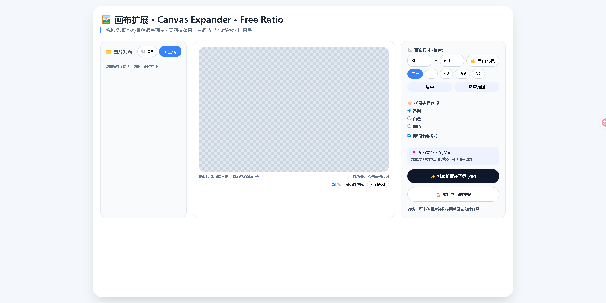

# 🖼️ Canvas Expander —— 自由画布扩展工具

> 一款可以**自由拖拽选框**调整画布、保留透明像素、批量导出的在线工具。

---

### ✨ 为什么你需要它？

市面上多数工具只能在原图像画布不变的情况下放大/缩小、裁剪图像，而不能真正地**修改画布(Canvas)大小**，但 **Canvas Expander** 允许你：
- 🖱️ **自由拖拽选框**：像调整窗口一样随意拖动选框边缘/角落，任意改变画布大小，直接实现图像的**自由拓展**。
- 📐 **任意比例与定位**：可将原图置于画布任意位置，实现单边/双边扩展。
- 🔍 **滚轮缩放 + 三等分参考线**：精细调整构图。
- 📦 **批量处理 + 保留透明**：一次处理多张，PNG透明通道完美保留。

---

### 🚀 在线使用

👉 [立即体验（GitHub Pages）](https://Sugaria0427.github.io/image-canvas-expander)

---

### 💻 本地使用

直接下载本仓库，用浏览器打开 `index.html` 即可，无需安装任何依赖。

---

### 🧩 核心功能

- 自由拖拽画布选框（移动 / 缩放）
- 预设比例锁定（1:1, 4:3, 16:9等）
- 鼠标滚轮缩放视图，双击重置
- 横向/纵向三等分参考线（九宫格）
- 批量导入图片，单张删除或一键清空
- 导出为 ZIP 压缩包，保留原始格式（PNG透明 / JPEG / WebP）

---

### 📸 界面预览

---

### 🛠️ 技术栈

* 原生 HTML5 + CSS3 + JavaScript，无其他框架依赖。

---

### 📄 开源许可

本项目采用 [MIT License](LICENSE) 开源，可自由使用、修改和分发。

---

⭐ 如果这个工具帮到了你，欢迎给个 Star 支持一下！
